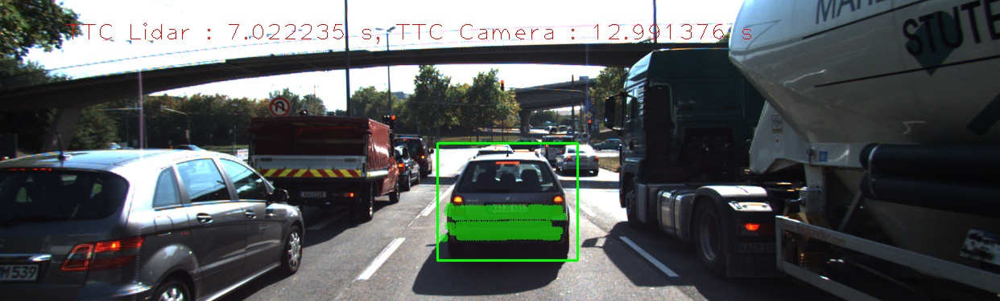
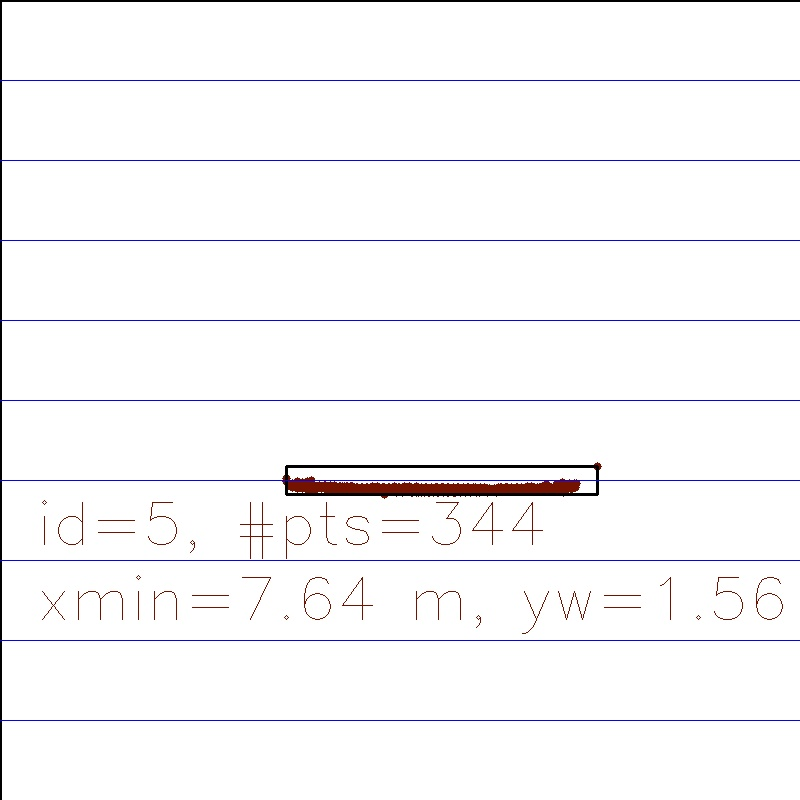
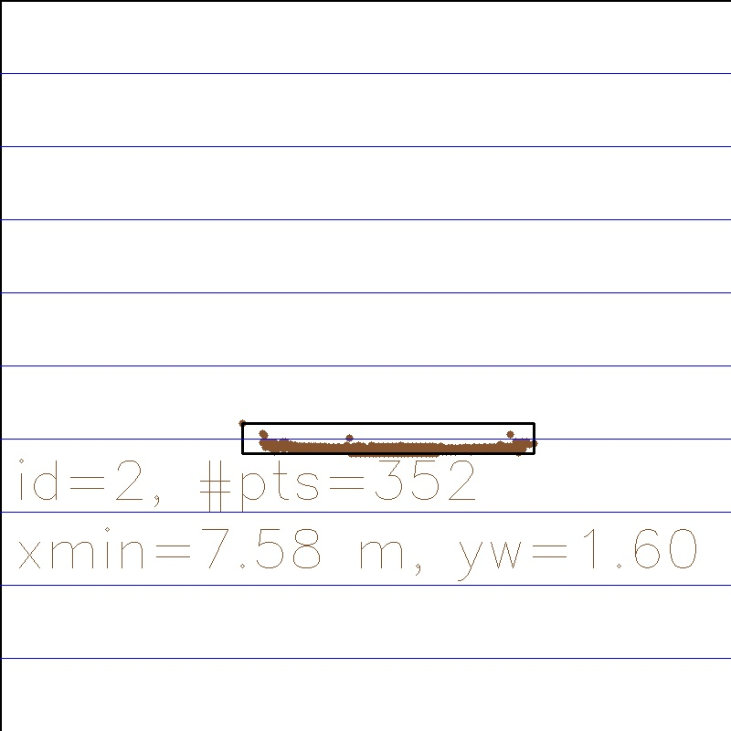
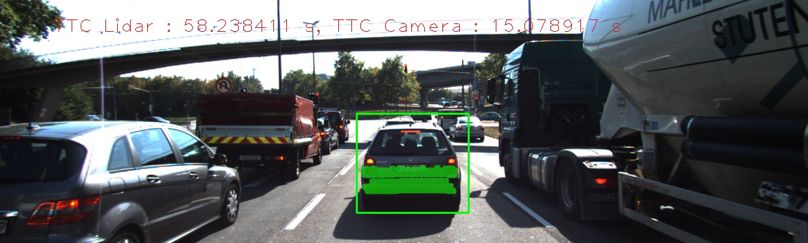
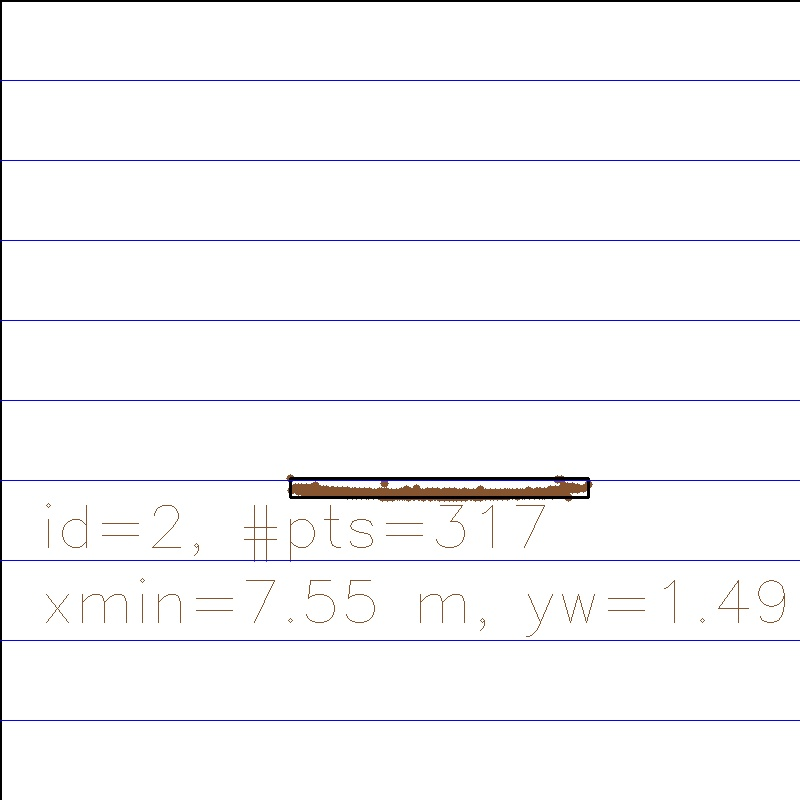
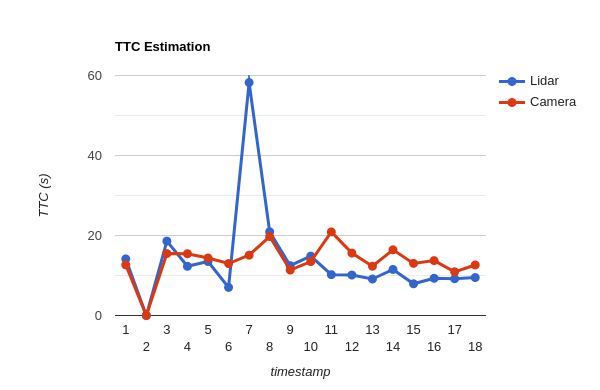
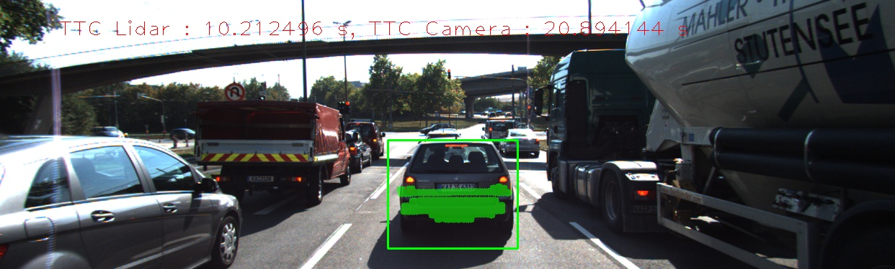
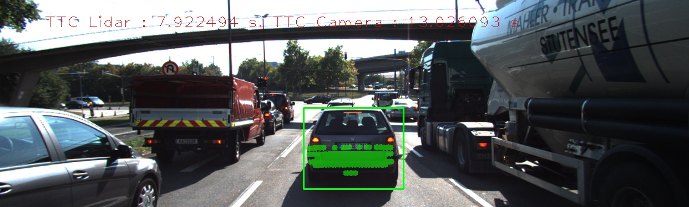

# 3D Object Tracking by Fusing Lidar & Camera

## Introduction


- First, a way to match 3D objects over time by using keypoint correspondences must be developed.

- Compute the TTC based on Lidar measurements.
- Then proceed to do the same using the camera, which requires to first associate keypoint matches to regions of interest and then to compute the TTC based on those matches.
- And lastly, you will conduct various tests with the framework. Goal is to identify the most suitable detector/descriptor combination for TTC estimation and also to search for problems that can lead to faulty measurements by the camera or Lidar sensor. 

**Note**, I have added my own basic config parser to avoid re-making when configs change (same as the one used in Lidar Project). This [config file](./src/configs.txt) contains the hyperparameter settings.

## Requirements

My specifications are as follows, 

* Xubuntu 18.04
* CMake v2.23.2
* OpenCV - v4.5.5
* C++ v11
* gcc v7.5.0


## Implementation Notes

- I have Copied relevant functions from [mid-term submission](../SFND_2D_Feature_Tracking/).
- Made some minor changes in ```show3DObjects``` to return the image instead of visualizing it.
- Made a function to visualize the images.
- Logged intermediate images in [results/](./results/) directory for debugging and visualization purposes. 
- Described results are achieved with SIFT detector and descriptor. 
YOLO input resolution is set to 608 x 608. 
BF matcher and NN selector with cross checking is used for matching.
These configs aren't changed unless stated otherwise.

## Build Instructions 

```bash
mkdir build && cd build
cmake ..
make
./3D_object_tracking
```

## Project Objectives

### Task 1

Match bounding boxes of two consecutive frames given keypoint matches.

```c++
void matchBoundingBoxes(std::vector<cv::DMatch> &matches, std::map<int, int> &bbBestMatches, DataFrame &prevFrame, DataFrame &currFrame){
    /*
    * Algorithm:
    *
    * For each match between the keypoints of current frame and previous frame:
    *      Find corresponding bbox for curr_kp
    *      Find corresponding bbox for prev_kp
    *
    *      if both boxes are found:
    *          increase the score for prev_kp_bboxId -> cur_kp_bboxId
    *
    * Go through mapping scores meaning for each prev_kp_bboxId:
    *      Find out highest scoring cur_kp_bboxId
    *      bbBestMatches[prev_kp_bboxId] = cur_kp_bboxId
    */

    // init variable to track matching scores
    std::unordered_map<int, std::unordered_map<int, std::vector<cv::DMatch>>> track_matches;
    std::unordered_map<int, std::unordered_map<int, int>> track_scores;


    // Loop through matches
    for(auto cur_match_it = matches.begin(); cur_match_it < matches.end(); ++cur_match_it){
        cv::KeyPoint curr_kp = currFrame.keypoints[cur_match_it->queryIdx];

        // find corresponding bbox for curr_kp here
        auto curr_kp_bbox_it = currFrame.boundingBoxes.end();
        for(auto cur_bbox_it = currFrame.boundingBoxes.begin(); cur_bbox_it < currFrame.boundingBoxes.end(); ++cur_bbox_it){
            if(cur_bbox_it->roi.contains(curr_kp.pt)){
                curr_kp_bbox_it = cur_bbox_it;
                break;
            }
        }

        cv::KeyPoint prev_kp = prevFrame.keypoints[cur_match_it->trainIdx];

        // find corresponding bbox for prev_kp here
        auto prev_kp_bbox_it = prevFrame.boundingBoxes.end();
        for(auto prev_bbox_it = prevFrame.boundingBoxes.begin(); prev_bbox_it < prevFrame.boundingBoxes.end(); ++prev_bbox_it){
            if(prev_bbox_it->roi.contains(prev_kp.pt)){
                prev_kp_bbox_it = prev_bbox_it;
                break;
            }
        }

        if(prev_kp_bbox_it != prevFrame.boundingBoxes.end() && curr_kp_bbox_it != currFrame.boundingBoxes.end()){
            track_matches[prev_kp_bbox_it - prevFrame.boundingBoxes.begin()][curr_kp_bbox_it - currFrame.boundingBoxes.begin()].push_back(*cur_match_it);
            ++track_scores[prev_kp_bbox_it - prevFrame.boundingBoxes.begin()][curr_kp_bbox_it - currFrame.boundingBoxes.begin()];
        }
    }

    // Loop through mappings of prev_kp_bbox -> map[curr_kp_bbox, score]
    for(auto const &tracks: track_matches){
        // find out highest scoring curr_kp_bbox
        int max_score = -1;
        int best_cur_bboxIdx = -1;
        for(auto const &track: track_scores[tracks.first]){
            if(track.second > max_score){
                max_score = track.second;
                best_cur_bboxIdx = track.first;
            }
        }
        if(max_score > 10) {
            bbBestMatches[prevFrame.boundingBoxes[tracks.first].boxID] = currFrame.boundingBoxes[best_cur_bboxIdx].boxID;
            
            currFrame.boundingBoxes[best_cur_bboxIdx].kptMatches = track_matches[tracks.first][best_cur_bboxIdx];
            for(auto const &match: currFrame.boundingBoxes[best_cur_bboxIdx].kptMatches){
                currFrame.boundingBoxes[best_cur_bboxIdx].keypoints.push_back(currFrame.keypoints[match.queryIdx]);
            }

            if(false) {
                cout << max_score << endl;

                cv::Rect prevBB = prevFrame.boundingBoxes[tracks.first].roi, curBB = currFrame.boundingBoxes[best_cur_bboxIdx].roi;
                float iou = (prevBB & curBB).area() / (float) (prevBB | curBB).area();
                cv::Mat cur_copy = currFrame.cameraImg.clone(), prev_copy = prevFrame.cameraImg.clone();
                cv::rectangle(prev_copy, prevBB, cv::Scalar(255, 0, 0), 2);
                cv::rectangle(cur_copy, curBB, cv::Scalar(255, 0, 0), 2);

                cv::Mat match_vis;
                cv::drawMatches(cur_copy, currFrame.keypoints, prev_copy, prevFrame.keypoints,
                                track_matches[tracks.first][best_cur_bboxIdx],
                                match_vis, cv::Scalar::all(-1), cv::Scalar::all(-1), vector<char>(),
                                cv::DrawMatchesFlags::DEFAULT);

                displayImg(match_vis, "bestMatches");
            }
        }
    }
}
```
- I have added a results' visualization for debugging purposes. 
It individually displays matched keypoints between two images along with corresponding bboxes (prev->current). 
These matches are collected through the shown algorithm, which is based on voting. 
The flag has to be turned on for visualization.
- While debugging, I found out that, sometimes the maximum number of votes are very less which causes false associations.
To solve the same, I have set a threshold to 10. If ```max_score``` is above this threshold, then only it is considered otherwise its discarded. 
Doing such helped in ignoring false bbox associations.
- **In addition, I have stored relevant keypoint matches (which concerns the bboxes of current frame) inside the vector of bounding box of current data frame. This assignment can be seen in code above the visualization flag check. Doing such will be helpful in Task-3.**

### Task 2

Compute Time to Collision from Lidar measurements.
```c++
void computeTTCLidar(std::vector<LidarPoint> &lidarPointsPrev,
                    std::vector<LidarPoint> &lidarPointsCurr, double frameRate, double &TTC){
    double dT = 1/frameRate;        // time between two measurements in seconds

    double minXCurr = findRobustClosestPoint(lidarPointsCurr, 3);
    double minXPrev = findRobustClosestPoint(lidarPointsPrev, 3);

    // compute TTC from both measurements
    TTC = minXCurr * dT / (minXPrev - minXCurr);
}
```

- A minor change has made here compared to class's [exercise](../SFND_Camera/) of Lidar TTC estimation.
- In previous exercise, the ```x_min``` values were calculated as absolute minimum from all clustered points. 
This method is likely to fail due to outliers, which are certainly encountered in Lidar data due to noise.
- A more robust method is considered here, **which calculates x_min as 3rd percentile of all data points**.
It will filter out the outliers. And the percentile value here is a parameter, which can be changed as I have written a function for the same. **3** turns out to be a good default value.


### Task 3

Cluster keypoint matches pertaining given the region of interest.
```c++
void clusterKptMatchesWithROI(BoundingBox &boundingBox, std::vector<cv::KeyPoint> &kptsPrev, std::vector<cv::KeyPoint> &kptsCurr, std::vector<cv::DMatch> &kptMatches)
{
    vector<cv::DMatch> potentialMatches;

    for(auto const &match: kptMatches){
        auto const cur_kp = kptsCurr[match.queryIdx];
        if(boundingBox.roi.contains(cur_kp.pt))
            potentialMatches.push_back(match);
    }

//    boundingBox.kptMatches.clear();
//    boundingBox.keypoints.clear();
//
//    // Keep only one
//
//    // potentialMatches = filterSigma(potentialMatches, kptsPrev, kptsCurr, 1);
//    potentialMatches = filterInterQuantile(potentialMatches, kptsPrev, kptsCurr);
//
//    boundingBox.kptMatches = potentialMatches;
//    for(auto const &match: boundingBox.kptMatches){
//        boundingBox.keypoints.push_back(kptsCurr[match.queryIdx]);
//    }
}

```
1. Goal of this task is to collect robust matches relevant to preceding vehicle's bounding bbox.
2. As a first step, all matches are collected, which are inside the bbox.
3. Now the resulting can be divided into two types,
    - **Incorrect matches**: A KP which is on the car in current frame certainly shouldn't map to outside the associated car bbox in previous frame. Hence, this type of matches must be discarded.
    - Current frame's KP maps to a point, which is **inside** the associated box in previous frame. This kind of matches might be correct or incorrect we have no way to tell. These ones should be considered for camera TTC calculations. Such is already solved this in task-1 (refer to bold text in task-1). Moreover, it's already stored at its respective location. Nothing should be done in above function.

3. Ignoring step-3, the matches can also be filtered as following. Calculate euclidean distances between query pixel coordinates and matched train pixel coordinates. Pick either of the below methods,
    - Keep matches whose distances are in inter-quantile range (25% to 75%). Implemented and commented out in the above code.
    - Keep matches whose distances are in between (mean - (1 x sigma)) and (mean - (1 x sigma)). *mean* is average distance and *sigma* is standard deviation of distances. This is a variation of 3-sigma rule. Same is also implemented and commented out.
4. Experimentation has proven that techniques shown in above step retains more number of matches compared to the technique shown in step-3. Hence, I have commented them out. Such can be changed as desired by uncommenting the above code.

### Task 4

Compute Time to Collision based on Camera measurements.

```c++
void computeTTCCamera(std::vector<cv::KeyPoint> &kptsPrev, std::vector<cv::KeyPoint> &kptsCurr, 
                    std::vector<cv::DMatch> kptMatches, double frameRate, double &TTC, cv::Mat *visImg)
{
    vector<double> distRatios; // stores the distance ratios for all keypoints between curr. and prev. frame
    TTC = NAN;
    if(kptMatches.size() < 2){
        return;
    }
    for (auto it1 = kptMatches.begin(); it1 != kptMatches.end() - 1; ++it1)
    { // outer keypoint loop

        // get current keypoint and its matched partner in the prev. frame
        cv::KeyPoint kpOuterCurr = kptsCurr.at(it1->trainIdx);
        cv::KeyPoint kpOuterPrev = kptsPrev.at(it1->queryIdx);

        for (auto it2 = kptMatches.begin() + 1; it2 != kptMatches.end(); ++it2)
        { // inner keypoint loop

            double minDist = 100.0; // min. required distance

            // get next keypoint and its matched partner in the prev. frame
            cv::KeyPoint kpInnerCurr = kptsCurr.at(it2->trainIdx);
            cv::KeyPoint kpInnerPrev = kptsPrev.at(it2->queryIdx);

            // compute distances and distance ratios
            double distCurr = cv::norm(kpOuterCurr.pt - kpInnerCurr.pt);
            double distPrev = cv::norm(kpOuterPrev.pt - kpInnerPrev.pt);

            if (distPrev > std::numeric_limits<double>::epsilon() && distCurr >= minDist)
            { // avoid division by zero

                double distRatio = distCurr / distPrev;
                distRatios.push_back(distRatio);
            }
        } // eof inner loop over all matched kpts
    }     // eof outer loop over all matched kpts

    // only continue if list of distance ratios is not empty
    if (distRatios.size() == 0){
        return;
    }

    double dT = 1 / frameRate;
    double medianDistRatio;
    int nb_ratios = distRatios.size();
    int med_idx = nb_ratios / 2;

    std::nth_element(distRatios.begin(), distRatios.begin() + med_idx, distRatios.end());
    if((nb_ratios % 2) == 0){
        std::nth_element(distRatios.begin(), distRatios.begin() + med_idx - 1, distRatios.end());
        medianDistRatio = (distRatios[med_idx] + distRatios[med_idx-1]) / 2;
    }
    else{
        medianDistRatio = distRatios[med_idx];
    }

    TTC = -dT / (1 - medianDistRatio);
}
```

- This function is copied from class's [exercise](../SFND_Camera/). 
Median value is considered for TTC calculation as its more robust than mean value.

### Task 5 

Identify faulty TTC estimates.

- Consider these faulty Lidar TTC estimates,

    - #### Case 1
        timestamp_6<br/>
        

        topview_5<br/>
        

        topview_6<br/>
        

        - According to top view images at timestamp_6, minXPrev and minXCurr are 7.64m and 7.58m (absolute minimum). Inside the program the same are 7.692m and 7.584m. The current distance estimate is nearly the same, but the previous estimate has error of 5cm. The topviews' x_min values give TTC estimate of approx. 12s, which is close to camera's TTC estimate. 

        - The error of 5cm was accounted, because 3rd percentile value was considered as robust estimate for x_min value (see task-2 for more details). Same method worked perfectly at timestamp_6. This negligible error caused significant error in TTC estimate 12s to 7s.

    - #### Case 2

        timestamp_7<br/>
        

        topview_6<br/>
        

        topview_7<br/>
        

        - According to top view images at timestamp_7, minXPrev and minXCurr are 7.58m and 7.55m (absolute minimum).
        Inside the program the same are 7.584m and 7.571m. Here, the previous distance estimate is nearly the same, 
        but the current estimate has error of 2cm. The topviews' x_min values give TTC estimate of approx. 25s,
        which is also far off from the camera TTC estimate.

        - The error of 2cm was accounted in current x_min value, because 3rd percentile value was considered as robust estimate for x_min value (see FP 2 for more details).
        Same method worked perfectly at timestamp_6. This negligible error caused significant error in TTC estimate.

- In conclusion, the above can't be resolved. If we consider absolute minimum, majority of Lidar estimates would become noticeably faulty due to outliers. With current approach, we might sometimes get erroneous estimate, which I believe is somewhat acceptable. Hence, current approach is definitely better than considering absolute minimum.

### Task 6
Collect all TTC observations in the excel file and discuss it.

- Look at [observations.xlsx](./observations.xlsx),
cell content is a long string formatted as below (excluding newlines)

    ```
    <frame_0>_<ttcLidar>_<ttcCamera>, 
    <frame_1>_<ttcLidar>_<ttcCamera>,
    .
    .
    .
    <frame_18>_<ttcLidar>_<ttcCamera>"
    ```

- In case where ```curBB->lidarPoints.size() > 0 && prevBB->lidarPoints.size() > 0``` is false, Lidar and Camera estimates are skipped. It will only display frame number, skipping the remaining part. **Note**, I have made sure that the preceding car is detected in each frame by setting YOLO input resolution to 608 x 608. Possible reasons for the same are described below,
    1. **Not enough number of keypoints are detected on preceding vehicle.**
    2. KPs aren't distributed equally on the car.
    3. In task-1 I mentioned a threshold on highest number of votes to ignore false associations. I had set it to 10, which might
    be too high.
    4. As a result of first three points, preceding car's bbox is found absent from ```bbBestMatches```, 
    which causes previously explained condition to become false every single time in the loop. 
    
- Doing this lengthy exercise has convinced me that SIFT rocks as a detector. All the other detectors barely gave one or two non empty entries (aforementioned string) no matter which descriptor was selected. My updated top-3 detector-descriptor recommendations are as follows,
    1. SIFT-BRIEF
    2. SIFT-BRISK
    3. SIFT-ORB

- SIFT-SIFT detector/descriptor combination is used, while generating below TTC estimates.

    

    ```text
    timestamp 1 to 18

    Lidar TTC: 14.1482 0 18.5999 12.3001 13.4947 7.02224 58.2384 20.9304 12.4583 14.8501 10.2125 10.1125 9.11646 11.5161 7.92249 9.3013 9.20136 9.48472 
    Camera TTC: 12.6585 0 15.4894 15.4461 14.3747 12.9914 15.0789 19.7381 11.3492 13.4775 20.8941 15.6131 12.3145 16.4267 13.0261 13.7256 10.922 12.6331
    ```

    - In overview, it is observed that camera's estimates are mostly slightly higher than Lidar's.

    - At TS-11, camera estimate (21s) is double the lidar estimate (10s). 
    

    - Secondly, at TS-15 camera estimate is 13s while the lidar estimate is 8s.
    

    - These estimates aren't too off unlike Lidar's (58s), thanks to the following.
        - Two sophisticated techniques have been used to robustly calculate TTC. 
            1. Clustering keypoint matches (Check task-3)
            2. Taking median of distance ratios in TTC camera equation.
        - It can be argued that, deviation observed in above two cases are caused by false matches. Because in clustering, matches satisfying **current bbox (preceding car) KPs -> previous bbox (preceding car) KPs** are only considered. On top of that, median of all distance ratios is selected. Hence, the culprit for wrong estimate must be the large number of incorrect matches.

    


