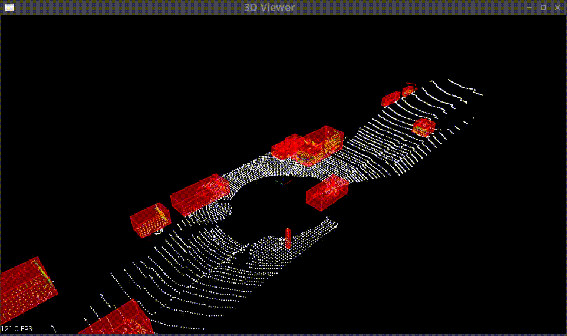
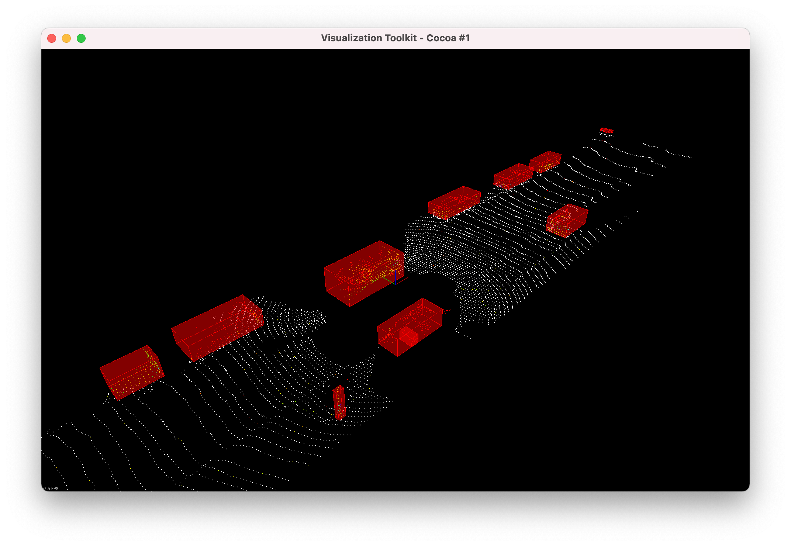
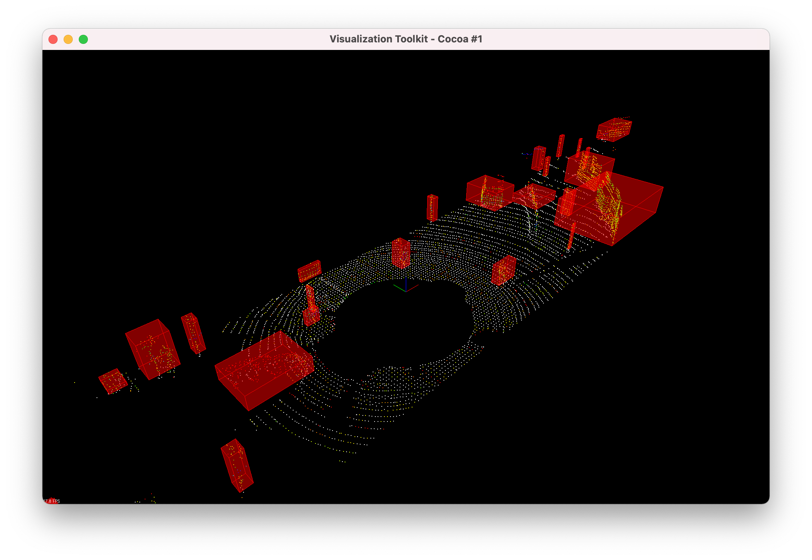

# Lidar Obstacle Detection



## Introduction

**Lidar** sensing gives us high resolution data by sending out thousands of laser signals. These lasers bounce off objects, returning to the sensor where we can then determine how far away objects are by timing how long it takes for the signal to return. Also we can tell a little bit about the object that was hit by measuring the intesity of the returned signal. Each laser ray is in the infrared spectrum, and is sent out at many different angles, usually in a 360 degree range. While lidar sensors gives us very high accurate models for the world around us in 3D.

 **Note**, I have added my own simple config parser in this project to avoid re-making the project every time the configs change. This change is reflected in [CMakeLists.txt](./CMakeLists.txt). This [config file](./src/configs.txt) contains relevant hyperparameter settings.

## Requirements

Versions used by me for this project are as follows:

* Xubuntu 18.04
* PCL (Point Cloud Library) - v1.8.1
* C++ v11
* gcc v7.5.0


## Setup (Ubuntu)

1. Clone this github repo:

    ```bash
    cd ~
    git clone https://github.com/hp2304/Udacity_Sensor_Fusion_ND.git
    ```

2. Execute the following commands in a terminal

    ```bash
    sudo apt install libpcl-dev
    cd ~/SFND_Lidar_Obstacle_Detection
    mkdir build && cd build
    cmake ..
    make
    ./environment
    ```

    To setup on other platforms refer to Udacity's [README](https://github.com/udacity/SFND_Lidar_Obstacle_Detection).


## Pseudocode

Loop over the stream of Point Cloud (PC) files. For each perform below steps,
    
1. Downsample PC using PCL's VoxelGrid class and then crop it given the x,y,z bounds configuration using PCL's CropBox class.
2. Delete points which correspond to the car's rooftop.
3. Segment ground plane points and obstacle points from the resulting PC using a **custom function**. It implements **RANSAC** algorithm to achieve the same.

    ```c++
    template<typename PointT>
    std::pair<typename pcl::PointCloud<PointT>::Ptr, typename pcl::PointCloud<PointT>::Ptr> ProcessPointClouds<PointT>::SegmentPlaneCustom(typename pcl::PointCloud<PointT>::Ptr cloud, int maxIterations, float distanceThreshold)
    {
        // Time segmentation process
        auto startTime = std::chrono::steady_clock::now();
        pcl::PointIndices::Ptr inliers(new pcl::PointIndices);

        std::vector<int> indices;

        // For max iterations
        for(int i=0; i<maxIterations; ++i) {
            // Randomly sample subset and fit line

            auto random_indices = sampleRandomIndices(0, cloud->points.size() - 1, 3);

            auto p1 = cloud->points[random_indices[0]];
            auto p2 = cloud->points[random_indices[1]];
            auto p3 = cloud->points[random_indices[2]];

            // v1 defined as a vector which goes to p2 from p1
            std::vector<float> v1{p2.x - p1.x, p2.y - p1.y, p2.z - p1.z};

            // v2 defined as a vector which goes to p3 from p1
            std::vector<float> v2{p3.x - p1.x, p3.y - p1.y, p3.z - p1.z};

            // ax + by + cz + d = 0
            float a = (v1[1] * v2[2]) - (v1[2] * v2[1]);
            float b = (v1[2] * v2[0]) - (v1[0] * v2[2]);
            float c = (v1[0] * v2[1]) - (v1[1] * v2[0]);
            float d = -((a * p1.x) + (b * p1.y) + (c * p1.z));

            float denom = sqrt((a*a) + (b*b) + (c*c));
            std::vector<int> current_inliers_indices;
            for(int j=0; j<cloud->points.size(); ++j) {
                // Measure distance between every point and fitted line
                auto const p = cloud->points[j];
                float dist = fabs((a * p.x) + (b * p.y) + (c * p.z) + d) / denom;

                // If distance is smaller than threshold count it as inlier
                if(dist <= distanceThreshold){
                    current_inliers_indices.push_back(j);
                }
            }

            if(current_inliers_indices.size() > indices.size()){
                indices = current_inliers_indices;
            }
        }
        inliers->indices = indices;

        auto endTime = std::chrono::steady_clock::now();
        auto elapsedTime = std::chrono::duration_cast<std::chrono::milliseconds>(endTime - startTime);
        std::cout << "plane segmentation took " << elapsedTime.count() << " milliseconds" << std::endl;

        std::pair<typename pcl::PointCloud<PointT>::Ptr, typename pcl::PointCloud<PointT>::Ptr> segResult = SeparateClouds(inliers, cloud);
        return segResult;
    }
    ```

4. Perform Euclidean Clustering to group points pertaining to an obstacle. This is custom implementation  utilizes the KdTree data structure.

    ```c++
    template<typename PointT>
    std::vector<typename pcl::PointCloud<PointT>::Ptr> ProcessPointClouds<PointT>::ClusteringCustom(typename pcl::PointCloud<PointT>::Ptr cloud, float clusterTolerance, int minSize, int maxSize)
    {

        // Time clustering process
        auto startTime = std::chrono::steady_clock::now();

        std::vector<typename pcl::PointCloud<PointT>::Ptr> clusters;

        // TODO:: Fill in the function to perform euclidean clustering to group detected obstacles

        std::vector<std::vector<float>> points;
        for(int i=0; i<cloud->points.size(); ++i) {
            auto p = cloud->points[i];
            std::vector<float> point{p.x, p.y, p.z, (float) i};
            points.push_back(point);
        }

    //    KdTree *tree = new KdTree(points);
        KdTree *tree = new KdTree;
        for(int i=0; i<points.size(); ++i)
            tree->insert(points[i], i);

        std::vector<std::vector<int>> cluster_indices = euclideanCluster(points, tree, clusterTolerance, minSize, maxSize);

        for(auto point_indices: cluster_indices){
            typename pcl::PointCloud<PointT>::Ptr cluster(new pcl::PointCloud<PointT>);
            for(auto point_idx: point_indices)
                cluster->points.push_back(cloud->points[point_idx]);
            cluster->width = cluster->points.size();
            cluster->height = 1;
            cluster->is_dense = true;
            clusters.push_back(cluster);
        }

        auto endTime = std::chrono::steady_clock::now();
        auto elapsedTime = std::chrono::duration_cast<std::chrono::milliseconds>(endTime - startTime);
        std::cout << "clustering took " << elapsedTime.count() << " milliseconds and found " << clusters.size() << " clusters" << std::endl;

        return clusters;
    }
    ```

    **Note**, the method taught in class to insert the points in KdTree is simple, which hurts the search query performance since the built tree won't be necessarily balanced. 
    
    I have implemented another method which builds the tree such that its hight is **log(N)** in **O(N*log(N))** time, where N is the number Lidar points. Such would speed up the search queries significantly. 
    
    **However in this case, PC files are processed in stream so doing such efficiently doesn't make much sense, since the number of search queries to be executed is limited. If it were to be repeated indefinitely for just one PC, this would certainly improve the performance.**

5. Display detected clusters. These clusters refer to different obstacles present around the car.

## Results

Pole on the right side of the car is also detected.

|  |  |
|-|-|


