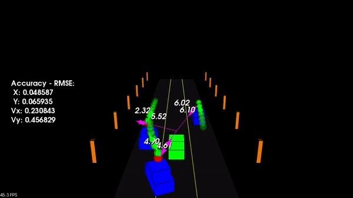

# Unscented Kalman Filter for Obstacle State Estimation



## Introduction

In this project, the Unscented Kalman Filter (UKF) is implemented to robustly estimate and predict the state of multiple cars on a simulated highway environment using **noisy Lidar and Radar measurements**.

**Note**, I have added my own basic config parser to avoid re-making when configs change (same as the one used in Lidar Project). This [config file](./src/configs.txt) contains the hyperparameter settings.


## Requirements

Versions used by me for this project are as follows:

* Xubuntu 18.04
* CMake v2.23.2
* PCL (Point Cloud Library) - v1.8.1
* C++ v11
* gcc v7.5.0

## Usage 

After cloning this repo, run below commands,
```bash
cd SFND_Unscented_Kalman_Filter
mkdir build && cd build
cmake ..
make
./ukf_highway
```

## Project Objectives

### Task 1

Initialize relevant variables.

### Task 2

Initialize state covariance matrix and call predict & update function of UKF.

```c++
void UKF::ProcessMeasurement(MeasurementPackage meas_package) {
  /**
   * TODO: Complete this function! Make sure you switch between lidar and radar
   * measurements.
   */
  if (!is_initialized_) {
    //cout << "Kalman Filter Initialization " << endl;

    // set the state with the initial location and zero velocity
    if(use_laser_ && meas_package.sensor_type_ == meas_package.LASER) {
        x_ << meas_package.raw_measurements_[0],
                meas_package.raw_measurements_[1],
                0, 0, 0;
        P_ = MatrixXd::Identity(n_x_, n_x_);
        P_(0, 0) = pow(std_laspx_, 2);
        P_(1, 1) = pow(std_laspy_, 2);

        time_us_ = meas_package.timestamp_;
        is_initialized_ = true;
    }
    else if(use_radar_ && meas_package.sensor_type_ == meas_package.RADAR){
        double rho = meas_package.raw_measurements_[0];
        double phi = meas_package.raw_measurements_[1];
        x_ <<   rho * cos(phi),
                rho * sin(phi),
                0, 0, 0;
        P_ = MatrixXd::Zero(n_x_, n_x_);
        P_(0, 0) = pow(std_radr_, 2);
        P_(1, 1) = pow(std_radr_, 2);
        P_(2, 2) = pow(std_radrd_, 2);
        P_(3, 3) = pow(std_radphi_, 2);
        P_(4, 4) = pow(std_radrd_, 2);

        time_us_ = meas_package.timestamp_;
        is_initialized_ = true;
    }
    return;
  }

  // compute the time elapsed between the current and previous measurements
  // dt - expressed in seconds
  double dt = (double)(meas_package.timestamp_ - time_us_) / 1000000.0;
  time_us_ = meas_package.timestamp_;

  // predict
  Prediction(dt);

  // measurement update
  if(use_laser_ && meas_package.sensor_type_ == meas_package.LASER){
    UpdateLidar(meas_package);
  }
  else if(use_radar_ && meas_package.sensor_type_ == meas_package.RADAR){
    UpdateRadar(meas_package);
  }
}
```

### Task 3

Implement UKF's predict step.

Given state values at timestep k, predict state values for the next timestep as below,

```c++
void UKF::Prediction(double delta_t) {
  /**
   * TODO: Complete this function! Estimate the object's location. 
   * Modify the state vector, x_. Predict sigma points, the state, 
   * and the state covariance matrix.
   */

    /**
     * @brief 
     * Part 1: Generate Sigma points in augmented state space
     */

    // create augmented mean vector
    VectorXd x_aug = VectorXd::Zero(n_aug_);

    // create augmented state covariance
    MatrixXd P_aug = MatrixXd::Zero(n_aug_, n_aug_);

    // create sigma point matrix
    MatrixXd Xsig_aug = MatrixXd(n_aug_, 2 * n_aug_ + 1);

    // create augmented mean state
    x_aug.head(n_x_) = x_;

    // create augmented covariance matrix
    P_aug.topLeftCorner(n_x_, n_x_) = P_;
    P_aug(n_x_, n_x_) = pow(std_a_, 2);
    P_aug(n_x_ + 1, n_x_ + 1) = pow(std_yawdd_, 2);

    // create square root matrix
    MatrixXd P_aug_root = P_aug.llt().matrixL();

    // create augmented sigma points
    double scalar = sqrt(lambda_ + n_aug_);
    Xsig_aug.col(0) = x_aug;
    for(int i=1; i<Xsig_aug.cols(); ++i){
        if(i >= 1 && i <= n_aug_){
            Xsig_aug.col(i) = x_aug + (P_aug_root.col(i - 1) * scalar);
        }
        else if(i >= (n_aug_ + 1)){
            Xsig_aug.col(i) = x_aug - (P_aug_root.col(i - n_aug_ - 1) * scalar);
        }
    }

    /**
     * @brief 
     * Part 2: Predict for k+1 timestep, for all sigma points
     */

    // create matrix with predicted sigma points as columns
    Xsig_pred_ = MatrixXd(n_x_, 2 * n_aug_ + 1);
    for(int i=0; i<Xsig_aug.cols(); ++i){
        double vel = Xsig_aug.col(i)[2];
        double yaw = Xsig_aug.col(i)[3];
        double yaw_rate = Xsig_aug.col(i)[4];

        double acc_noise = Xsig_aug.col(i)[5];
        double yaw_acc_noise = Xsig_aug.col(i)[6];
        VectorXd v1(n_x_), v2(n_x_);

        v2 << 0.5 * pow(delta_t, 2) * cos(yaw) * acc_noise,
                0.5 * pow(delta_t, 2)  * sin(yaw) * acc_noise,
                delta_t * acc_noise,
                0.5 * pow(delta_t, 2) * yaw_acc_noise,
                delta_t * yaw_acc_noise;
        if(fabs(yaw_rate) < 0.001){
            v1 << vel * delta_t * cos(yaw),
                    vel * delta_t * sin(yaw),
                    0, delta_t * yaw_rate, 0;
        }
        else{
            v1 << (vel/yaw_rate)*(sin(yaw + delta_t * yaw_rate) - sin(yaw)),
                    (vel/yaw_rate)*(-cos(yaw + delta_t * yaw_rate) + cos(yaw)),
                    0, delta_t * yaw_rate, 0;

        }
        Xsig_pred_.col(i) = Xsig_aug.col(i).head(n_x_) + v1 + v2;
    }

    /**
     * @brief 
     * Part 3: 
     * 1. Approximate the non linear transformation's results (CTRV model) as Gaussian distribution
     * 2. Update x and P
     */
    // create vector for predicted state
    VectorXd x_pred = VectorXd::Zero(n_x_);

    // create covariance matrix for prediction
    MatrixXd P_pred = MatrixXd::Zero(n_x_, n_x_);

    // predict state mean
    for(int i=0; i<(2*n_aug_+1); ++i){
        x_pred += (Xsig_pred_.col(i) * weights_[i]);
    }

    // predict state covariance matrix
    for(int i=0; i<(2*n_aug_+1); ++i){
        VectorXd col = Xsig_pred_.col(i) - x_pred;
        P_pred += ((col * col.transpose()) * weights_[i]);
    }

    // update state and covariance matrix
    x_ = x_pred;
    P_ = P_pred;
}
```

1. Generate sigma points in augmented space.
2. Predict (**according to Constant Turn Rate & Velocity Motion Model**) for (k+1) timestep for each generated sigma points in above step.
3. Estimate the non-Gaussian output distribution as Gaussian and update the state mean & covariance matrix.

Refer the UKF's [exercises](../SFND_UKF_Exercises/) for reference.

### Task 4

Implement update step for Lidar measurement. Since there is no non-linear transformation involved here, UKF's update step will be same as vanilla KF.

```c++
void UKF::UpdateLidar(MeasurementPackage meas_package) {
  /**
   * TODO: Complete this function! Use lidar data to update the belief 
   * about the object's position. Modify the state vector, x_, and 
   * covariance, P_.
   * You can also calculate the lidar NIS, if desired.
   */
  VectorXd z_pred = H_ * x_; // 2x5 5x1 = 2x1

  VectorXd z = meas_package.raw_measurements_;
  VectorXd y = z - z_pred; // 2x1

  MatrixXd Ht = H_.transpose(); // 5x2
  MatrixXd PHt = P_ * Ht; // 5x5 5x2 = 5x2
  MatrixXd S = H_ * PHt + R_; // 2x5 5x2 + 2x2 = 2x2
  MatrixXd Si = S.inverse(); // 2x2
  
  MatrixXd K = PHt * Si; // 5x2 2x2 = 5x2

  //new estimate
  x_ += (K * y); // 5x2 2x1 = 5x1
  MatrixXd I = MatrixXd::Identity(n_x_, n_x_);
  P_ = (I - K * H_) * P_; // 5x5 5x5 = 5x5

  VectorXd nis = y.transpose() * Si * y;
  std::cout << "NIS LIDAR: " << nis(0, 0) << std::endl;
}
```

### Task 5

Implement update step for Radar measurement. Here, a non-linear transformation is involved, when we move from state space to Radar's measurement space.

```c++
void UKF::UpdateRadar(MeasurementPackage meas_package) {
  /**
   * TODO: Complete this function! Use radar data to update the belief 
   * about the object's position. Modify the state vector, x_, and 
   * covariance, P_.
   * You can also calculate the radar NIS, if desired.
   */

  /**
   * @brief 
   * Part 1: Project predicted sigma points from state space to measurement space
   * Approximate the same nonlinear transformation as Gaussian 
   */
  int n_z = 3;
  // create matrix for sigma points in measurement space
  MatrixXd Zsig = MatrixXd(n_z, 2 * n_aug_ + 1);

  // mean predicted measurement
  VectorXd z_pred = VectorXd::Zero(n_z);

  // measurement covariance matrix S
  MatrixXd S = MatrixXd::Zero(n_z, n_z);

  // transform sigma points into measurement space
  for(int i=0; i<(2 * n_aug_ + 1); ++i){
      auto px = Xsig_pred_.col(i)[0];
      auto py = Xsig_pred_.col(i)[1];
      auto vel = Xsig_pred_.col(i)[2];
      auto yaw = Xsig_pred_.col(i)[3];

      Zsig.col(i)[0] = sqrt(pow(px, 2) + pow(py, 2));
      Zsig.col(i)[1] = std::atan2(py, px);
      Zsig.col(i)[2] = (vel * (px * cos(yaw) + py * sin(yaw)))/Zsig.col(i)[0];
  }

  // calculate mean predicted measurement
  for(int i=0; i<(2*n_aug_+1); ++i){
      z_pred += (Zsig.col(i) * weights_[i]);
  }

  // calculate innovation covariance matrix S
  for(int i=0; i<(2*n_aug_+1); ++i){
      VectorXd col = Zsig.col(i) - z_pred;
      S += ((col * col.transpose()) * weights_[i]);
  }
  MatrixXd R = MatrixXd::Zero(n_z, n_z);
  R.diagonal() << pow(std_radr_, 2), pow(std_radphi_, 2), pow(std_radrd_, 2);
  S += R;

  /**
   * @brief 
   * Part 2: Perform the measurement update step
   */

  // create matrix for cross correlation Tc
  MatrixXd Tc = MatrixXd::Zero(n_x_, n_z);

  // calculate cross correlation matrix
    for(int i=0; i<(2*n_aug_ + 1); ++i){
        VectorXd c1 = Xsig_pred_.col(i) - x_;
        VectorXd c2 = Zsig.col(i) - z_pred;
        Tc += ((c1 * c2.transpose()) * weights_[i]);
    }

    // calculate Kalman gain K;
    MatrixXd Si = S.inverse();
    MatrixXd K = Tc * Si;

    VectorXd z = meas_package.raw_measurements_;
    VectorXd y = z - z_pred;

    // update state mean and covariance matrix
    x_ += K * y;
    P_ -= K * S * K.transpose();

    VectorXd nis = y.transpose() * Si * y;
    std::cout << "NIS RADAR: " << nis(0, 0) << std::endl;
}
```

1. Transform predicted sigma points (calculated in task-3's predict step) to measurement space from augmented space.
2. Calculate mean predicted measurement and innovation covriance matrix.
3. Update state mean and covariance matrix according to UKF equations.

Refer the UKF's [exercises](../SFND_UKF_Exercises/) for reference.


### Task 6

Tune relevant hyperparameters to pass the RMSE tolerance criteria.

## Results

Normalized Innovation Squared (NIS) is calculated for both [Radar](radar_nis.txt) and [Lidar](lidar_nis.txt). NIS values indicate whether the KF is working effectively or not. 

Approximately 9% of the values are greater than 7.8 (3 DOF and 5% value, Chi-squared Distribution) for Radar. Approximately 6% of the values are greater than 5.99 (2 DOF and 5% value, Chi-squared Distribution) for Lidar. These statistics suggest that the UKF passes the consistency check (neither underestimating nor overestimating). 


**As seen above, RMSEs for shown parameters is not exceeding the tolerance threshold. Otherwise, it would have shown the text in Red color.**